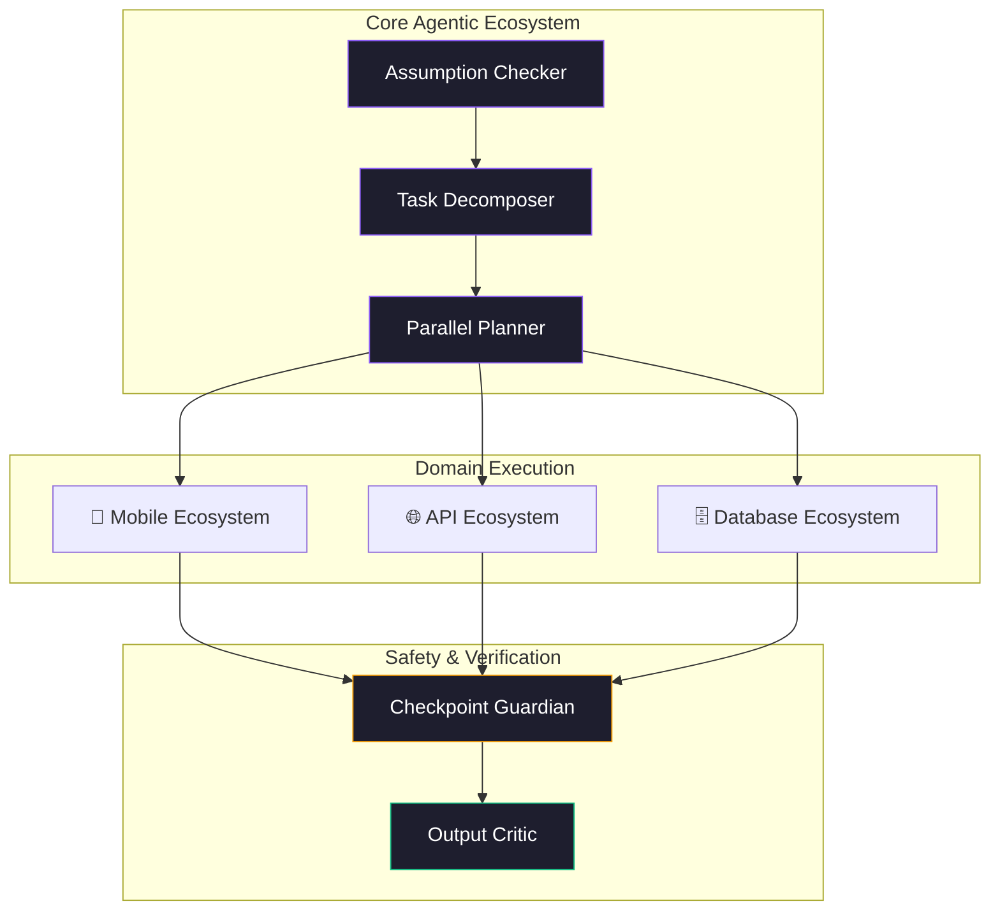

<!-- BÜYÜK VE DİNAMİK BAŞLIK (Typing SVG) -->

  <em>Designing scalable architectures, AI-driven ecosystems, and hybrid handoff patterns.</em>

<!-- SOSYAL MEDYA / İLETİŞİM ROZETLERİ -->

  
  
  

---

### 🧠 Architecting the Future: Layered Monorepo & AI Agents

I don't just write code; I design ecosystems. My current focus is developing **`fth-skills`**, a curated collection of agentic AI skills that utilize **Hybrid Handoff Patterns** to automate complex software development life cycles (SDLC).

---

### 🚀 Tech Stack & Toolkit

  

 

| Core Expertise          | Domain Domains                      | DevOps & Architecture     |
| :---------------------- | :---------------------------------- | :------------------------ |
| Agentic Workflows       | Backend Architecture (REST/GraphQL) | Monorepo Orchestration    |
| Ecosystem Design        | Frontend (React/Next.js)            | CI/CD & Automation        |
| Parallel Planning Tools | Mobile Development (Concept)        | Cloud & Security Auditing |

---

### 📊 Ecosystem Analytics

  
  

---

### 🌟 Featured Masterpieces

- 📦 **[fth-skills](https://github.com/fatih-developer/fth-skills):** Curated AI agent skills for coding workflows, decision-making, and agentic task safety. Features 45+ capabilities acting as a coordinated team.
- 🤖 **[RitmoControl](#):** The Core Orchestrator for managing multi-agent environments and dynamic tasks. _(Add your real link if applicable)._

  

