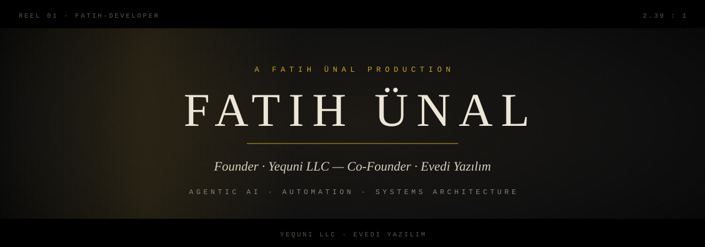
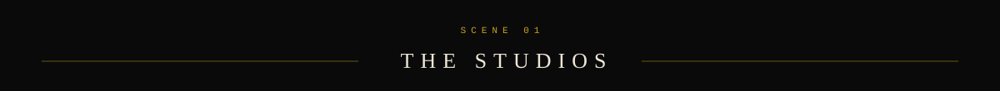
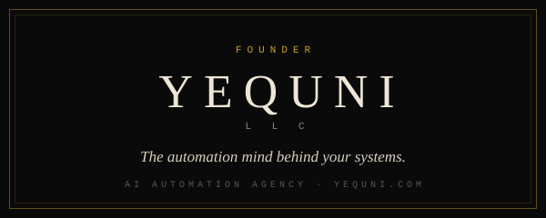
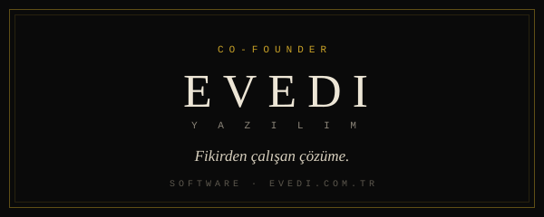
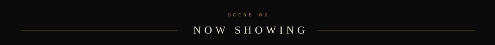
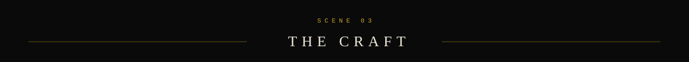
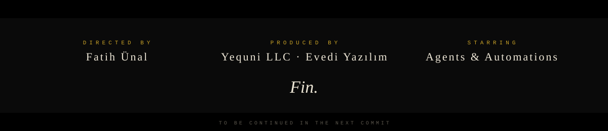

 

&nbsp;&nbsp;&nbsp;

  

&nbsp;

<b>Yequni</b> designs, builds and ships operations end-to-end with intelligent automation, AI assistants and API integrations. 
<b>Evedi Yazılım</b> takes ideas all the way to working software. New site in production.

  

| Title | Logline |
| :-- | :-- |
| **[fth-skills](https://github.com/fatih-developer/fth-skills)** | Curated agent skills for coding workflows, decision-making and safe agentic work. Packaged for [skills.sh](https://skills.sh/fatih-developer/fth-skills). |
| **[fermata](https://github.com/fatih-developer/fermata)** | A local supervisor for long Codex and Claude Code runs: it checkpoints before the usage limit, waits for the reset and resumes the same session. .NET 10. |
| **[keyset](https://github.com/fatih-developer/keyset)** | Project-aware OAuth setup and verification for Next.js, Better Auth, Auth.js, CLI and MCP. |

 

Agentic AI workflows · Automation architecture · Backend systems · Mobile · Developer tooling

  

